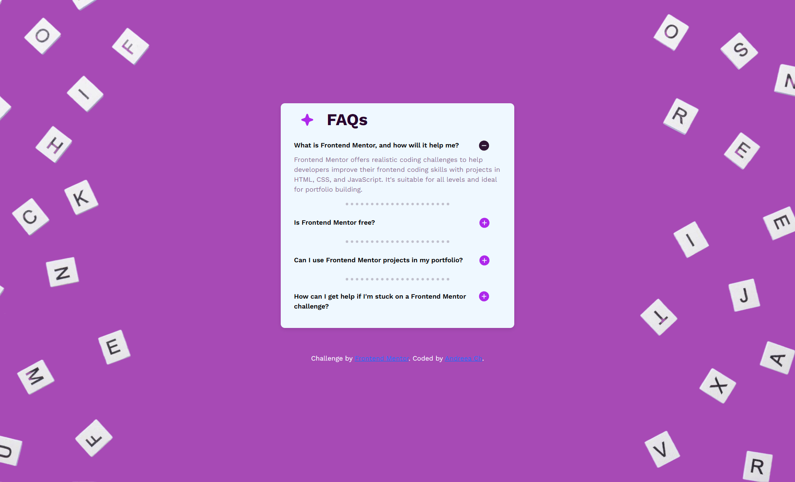
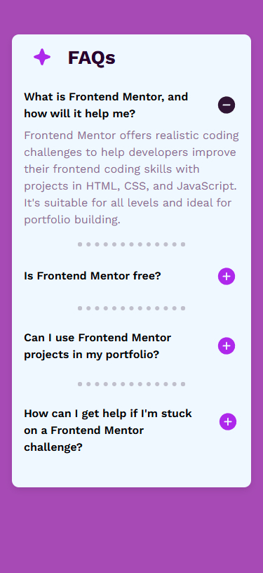

# Frontend Mentor - FAQ accordion solution

This is a solution to the [FAQ accordion challenge on Frontend Mentor](https://www.frontendmentor.io/challenges/faq-accordion-wyfFdeBwBz). Frontend Mentor challenges help you improve your coding skills by building realistic projects. 

## Table of contents

- [Overview](#overview)
  - [The challenge](#the-challenge)
  - [Screenshot](#screenshot)
  - [Links](#links)
- [My process](#my-process)
  - [Built with](#built-with)
  - [What I learned](#what-i-learned)
  - [Useful resources](#useful-resources)

## Overview

### The challenge

Users should be able to:

- Hide/Show the answer to a question when the question is clicked
- Navigate the questions and hide/show answers using keyboard navigation alone
- View the optimal layout for the interface depending on their device's screen size
- See hover and focus states for all interactive elements on the page

### Screenshot





### Links

- Solution URL: [https://github.com/andr-ch/Accordion-challenge.git](https://github.com/andr-ch/Accordion-challenge.git)
- Live Site URL: [https://andr-ch.github.io/Accordion-challenge/](https://andr-ch.github.io/Accordion-challenge/)

## My process

### Built with

- Semantic HTML5 Markup: Used to structure the content in a meaningful and accessible way.
- Bootstrap 5.3.0: Leveraged for responsive design and pre-built components to ensure a consistent and professional layout.
- CSS Custom Properties: Employed variables to maintain design consistency and facilitate easier updates and theming.
- Flexbox: Utilized for flexible, efficient layout structures that adapt seamlessly across various screen sizes.
- Mobile-First Workflow: Designed the interface with mobile users as the primary focus, then enhanced for larger screens.
- Google Fonts: Incorporated custom fonts to enhance typography and maintain a unique design aestheti


### What I learned

1. **How to make a collapsible section:**

  a. to create a nice, interactive section without writing a lot of extra code:
```html
<div class="accordion g-0" id="accordionExample">```:
 
	Here I learned:
- accordion → A Bootstrap class that makes a collapsible section (like a FAQ where you can click to show/hide answers).
- g-0 → Means "gap 0", to remove spacing between elements inside.
- id="accordionExample" → gives this section a name (ID) so JavaScript or links can control it.


  b. to keep things close together without extra gaps:
```html
<h2 class="mb-0">```:

	Here I learned:
- h2 → A heading (like a title) that is a bit smaller than h1.
- mb-0 → Means "margin bottom 0", which removes space below the heading.


2. **Using the "button" Element to Create Interactive FAQs:**
```html
<button class="btn btn-link w-100 fw-semibold" type="button" data-bs-toggle="collapse" data-bs-target="#collapseOne" aria-expanded="true" aria-controls="collapseOne">```:

	Here I learned:
- the <button> →  to create clickable buttons on a webpage.
- the "btn-link" → to make a button look like a link (no button style, just text).
- "w-100" → to make the button take up the full width
- "fw-semibold" → to make the text a little bold, but not fully bold.
- type="button" → to tell the browser it's a normal button (not for submitting a form).
- data-bs-toggle="collapse" → to make the button interactive, so when clicked, it shows or hides extra information (in this case, FAQ answers).
- the data-bs-target="#collapseOne" → to link the button to a section of text that will be revealed when clicked.
- aria-expanded="true" → to help screen readers know if the section is open (true) or closed (false).
- aria-controls="collapseOne" → using another accessibility helper that tells what section this button controls.

3. **Using the "span" Element for Icons Inside Buttons:**
 ```html
<span class="icon-toggle plus-icon">
    
</span>```

	Here I learned:

- the <span> element is a small, inline container that can hold text or images.
- it helps organize icons inside the button, making them easy to style separately from the text.
- the  inside the <span> → to display an icon, like a plus (+) or minus (-) sign.

4. **To make hidden content that appears when clicking the button:**
 ```html
<div id="collapseOne" class="collapse show" aria-labelledby="headingOne" data-bs-parent="#accordionExample">
  <div class="card-body">...</div>```

	Here I learned:
- <div id="collapseOne"> → a section with the ID "collapseOne." This is the content that will be shown/hidden when clicking the button.
- class="collapse show" →
	collapse → means this section is collapsible (can open and close).
	show → starts open by default. if removed, the section will start hidden.
- aria-labelledby="headingOne" → to help screen readers know that "headingOne" is the title of this section.
- data-bs-parent="#accordionExample" → Makes it part of an accordion (only one section can be open at a time).
- <div class="card-body">...</div> → to hold the content inside (text, images, etc.).


6. **Using scripts to use advanced UI features in the webpage:**
  a. Pooper.js:
```html
<script src="https://cdn.jsdelivr.net/npm/@popperjs/core@2.11.8/dist/umd/popper.min.js" integrity="sha384-I7E8VVD/ismYTF4hNIPjVp/Zjvgyol6VFvRkX/vR+Vc4jQkC+hVqc2pM8ODewa9r" crossorigin="anonymous"></script>
```
  b. Bootstrap:
```html
<script src="https://cdn.jsdelivr.net/npm/bootstrap@5.3.3/dist/js/bootstrap.min.js" integrity="sha384-0pUGZvbkm6XF6gxjEnlmuGrJXVbNuzT9qBBavbLwCsOGabYfZo0T0to5eqruptLy" crossorigin="anonymous"></script>
```
	Here I learned:
- Pooper.js → to manage popups, tooltips, dropdowns, and other UI elements that need to be dynamically positioned.
- Bootstrap → to provide pre-built components and utilities, like modals, tooltips, and carousels. 

7. **Spreading items far apart inside the button:**
 ```css

button {
...
justify-content: space-between;
...
}
```
	Here I learned:
- to spread the items (like icons or text) inside the button evenly, with the first item at the start and the last item at the end

8. **Controlling how icons (like + and -) appear when clicking a button in an accordion (expand/collapse section):**
```css
.icon-toggle {
    display: inline-block;
}

.icon-minus {
    display: none;
}

.collapsed .icon-plus {
    display: inline;
}

.collapsed .icon-minus {
    display: none;
}

.btn-link:not(.collapsed) .icon-plus {
    display: none;
}

.btn-link:not(.collapsed) .icon-minus {
    display: inline;
}
```

	Here I learned:
- .icon-toggle { display: inline-block; } → to make sure icons (+ or -) are shown inline, like text.

- .icon-minus { display: none; } → to hide the minus (-) icon by default.

- .collapsed .icon-plus { display: inline; } → if the button has collapsed, the plus (+) icon is visible.

- .collapsed .icon-minus { display: none; }  → if the button has collapsed, the minus (-) icon stays hidden.

- .btn-link:not(.collapsed) .icon-plus { display: none; } → if the button is NOT collapsed, hide the plus (+) icon.

- .btn-link:not(.collapsed) .icon-minus { display: inline; } → if the button is NOT collapsed, show the minus (-) icon.


9. **Using special styling for heading four icons:**
```css
.question-3 .icon-toggle{
    position: relative;
    left: 19px;
}

.question-4 .icon-toggle {
    position: relative;
    top: -12px; }
```
	Here I learned:
- "top", "left" → to move the icon separately from the others


### Useful resources


- [Bootstrap](https://getbootstrap.com/docs/5.3/getting-started/introduction/) - This helped me understand how to use Bootstrap's grid system and utility classes effectively. It was particularly useful for organizing content and ensuring responsiveness across different screen sizes.

- [Google Fonts](https://fonts.google.com/) - This resource was invaluable for integrating custom fonts into my project. 

- [CSS Tricks (Flexbox Guide)  ](https://css-tricks.com/snippets/css/a-guide-to-flexbox/) - This article on Flexbox helped me understand how to align and distribute space among items in a container, which was essential for styling my stats section and ensuring it looked good on all devices.

- [CSS Tricks (Media Queries Guide) ](https://css-tricks.com/snippets/css/media-queries-for-standard-devices/) - This is an amazing reference for setting up media queries. It helped me ensure my layout looks great on different screen sizes, and I’d recommend it to anyone working on responsive designs.

- [MDN Web Docs on CSS Media Queries](https://developer.mozilla.org/en-US/docs/Web/CSS/CSS_media_queries/Using_media_queries) - This resource was crucial for learning how to apply different styles based on screen size. It allowed me to create a responsive design that adapts to various screen resolutions.

- [CSSmatic - Border Radius Generator ](https://www.cssmatic.com/border-radius) - Helpful for experimenting and generating CSS styles such as border radius, box shadow, and more.

- [W3Schools - Bootstrap Collapse ](https://www.w3schools.com/bootstrap/bootstrap_collapse.asp) - This helped me understand how to create collapsible content in Bootstrap. 

- [BootstrapBrain - Bootstrap Accordion with Plus-Minus Icon](https://bootstrapbrain.com/tutorial/bootstrap-accordion-with-plus-minus-icon/#:~:text=You%20can%20change%20the%20default,after%20loading%20the%20accordion%2D6.) - This is an amazing tutorial that helped me enhance Bootstrap accordions with plus and minus icons. 

- [SheCodes - How to Make an Icon Smaller in CSS](https://www.shecodes.io/athena/36133-how-to-make-an-icon-smaller-in-css) - This helped me understand how to resize icons in CSS properly.


